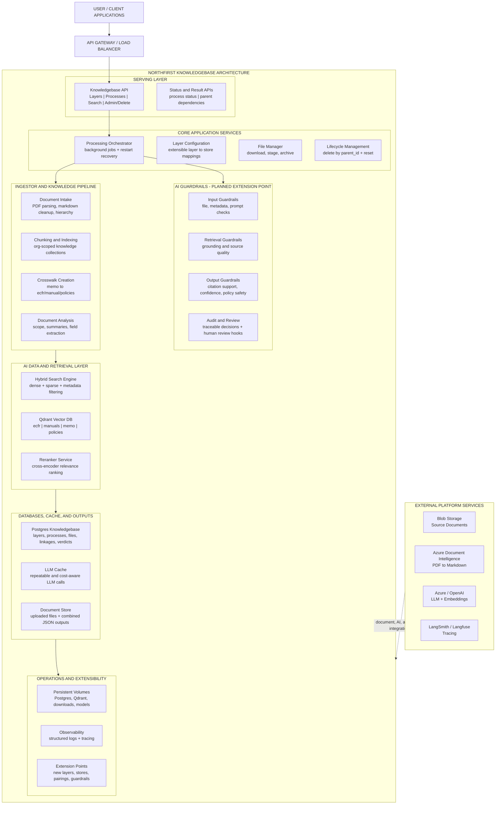

# NorthFirst Knowledgebase Architecture Diagrams

These diagrams summarize the current repository architecture and the memo `add_items_to_layer` ingestion flow. They intentionally include current robustness mechanisms and planned AI Guardrails as an extension point.

## 1. System Block Diagram

## 2. Memo Upload and Crosswalk Creation Flow

```mermaid
flowchart TD
    Start["Client calls POST /add_items_to_layer<br/>layer_hash = cms_memo, parent_id, org_id,<br/>docs[], index/ingest flags"]
    LayerLookup["Resolve layer in Postgres"]
    LayerMissing{"Layer exists?"}
    NoLayer["Return 404 Layer not found"]
    Flags{"index or ingest enabled?"}
    NoOp["Return no-op response<br/>no process created"]
    CreateProcess["Create Process row<br/>status = IN_PROGRESS, progress = 0%,<br/>metadata includes index, ingest, get_scope, get_summaries"]
    DownloadDocs["Download each blob_url<br/>to downloads/org/cms_memo/process_id"]
    SaveFiles["Create ProcessFile rows<br/>commit saved file paths"]
    Queue["FastAPI BackgroundTasks<br/>queue simulate_processing(process_id)"]
    Accepted["Return process_id<br/>client can poll status"]

    Poll["Client polls GET /get_process_status/{process_id}"]
    Fetch["Client fetches GET /get_parent_dependencies/{parent_id}"]

    WorkerStart["simulate_processing loads Process<br/>layer, org_id, parent_id, files"]
    Recovery["Startup recovery path<br/>restart_unfinished_processes requeues IN_PROGRESS jobs<br/>single worker lock prevents duplicate recovery"]
    StoreConfig["get_store_config('cms_memo', org_id)"]
    Pairings["Configured pairings for memo<br/>1. memo to ecfr - strict_authority<br/>2. memo to manual - strict_authority<br/>3. memo to policies - impact_analysis"]
    Cleanup["Delete existing vector data by parent_id<br/>before re-ingestion"]
    FileLoop["For each uploaded memo file"]
    PairLoop["For each configured pairing<br/>parsed PDF content is reused across pairings"]

    ParseNeeded{"full_content_dict already available?"}
    ParsePDF["process_pdf_ LangGraph intake pipeline"]
    Azure["Azure Document Intelligence<br/>PDF to markdown"]
    Clean["LLM clean beginning / TOC"]
    Headers["LLM structured header correction"]
    Hierarchy["Build hierarchy tree and flatten sections"]
    Scope["Optional scope summary"]
    Summaries["Optional section summaries"]

    Index["Chunk sections<br/>write memo chunks to Qdrant memo_chunked org collection<br/>metadata: parent_id, organisation_id, section, filename"]
    IngestDecision{"ingest enabled and reference store exists?"}
    IndexOnly["Return empty crosswalk output<br/>index-only mode"]

    CrosswalkAll["crosswalks_for_all_the_sections<br/>async concurrency limited by max_workers"]
    SectionGraph["For each section: complete_crosswalk_for_section"]
    Concepts["LLM extracts regulatory or impact concepts"]
    Search["Hybrid Qdrant search per concept<br/>dense embeddings + weighted n-gram sparse retrieval"]
    Rerank["Single rerank over deduplicated candidates<br/>reranker service with concurrency limit"]
    Filter["Score threshold filters candidates<br/>MIN_RERANKER_SCORE"]
    Verify["LLM batch verification with GPT-4o<br/>stores accept/reject verdicts in Postgres"]
    Coverage["Mode-aware coverage check<br/>strict_authority stops when authority found;<br/>impact_analysis can identify missing policy areas"]
    Complete{"Covered or max iterations reached?"}
    Refine["LLM refines search queries<br/>uses feedback and previous queries"]
    PostProcess["Post-process references<br/>return accepted references"]

    Merge["Merge pairing result into combined_output<br/>section -> target label -> references"]
    MorePairings{"More pairings?"}
    SaveJSON["Save combined JSON output<br/>downloads/base_name_combined.json"]
    RudEntry["Create RudamentaryLinkagesOfManuals row<br/>points to saved JSON"]
    CompleteProcess["Mark Process COMPLETED<br/>progress cleared, result updated"]
    PairError["If one pairing fails:<br/>log error and continue remaining pairings"]
    FatalError["Unhandled failure:<br/>mark Process FAILED with error"]

    GuardInput["AI Guardrails planned<br/>input/file/prompt policy checks"]
    GuardRetrieval["AI Guardrails planned<br/>retrieval grounding and candidate controls"]
    GuardOutput["AI Guardrails planned<br/>crosswalk output validation and audit hooks"]

    Start --> LayerLookup --> LayerMissing
    LayerMissing -- no --> NoLayer
    LayerMissing -- yes --> Flags
    Flags -- no --> NoOp
    Flags -- yes --> CreateProcess --> DownloadDocs --> SaveFiles --> Queue --> Accepted
    Accepted --> Poll
    Accepted --> Fetch

    Recovery -. "requeue" .-> WorkerStart
    Queue --> WorkerStart
    WorkerStart --> StoreConfig --> Pairings --> Cleanup --> FileLoop --> PairLoop
    PairLoop --> ParseNeeded
    ParseNeeded -- no --> ParsePDF
    ParseNeeded -- yes --> Index
    ParsePDF --> Azure --> Clean --> Headers --> Hierarchy
    Hierarchy --> Scope --> Summaries --> Index
    Hierarchy --> Summaries
    Index --> IngestDecision
    IngestDecision -- no --> IndexOnly --> Merge
    IngestDecision -- yes --> CrosswalkAll --> SectionGraph --> Concepts --> Search --> Rerank --> Filter --> Verify --> Coverage --> Complete
    Complete -- no --> Refine --> Search
    Complete -- yes --> PostProcess --> Merge
    Merge --> MorePairings
    MorePairings -- yes --> PairLoop
    MorePairings -- no --> SaveJSON --> RudEntry --> CompleteProcess --> Fetch

    PairLoop -. "pairing exception" .-> PairError -. "continue" .-> MorePairings
    WorkerStart -. "unhandled exception" .-> FatalError

    GuardInput -. "planned" .-> Start
    GuardInput -. "planned" .-> ParsePDF
    GuardRetrieval -. "planned" .-> Search
    GuardRetrieval -. "planned" .-> Verify
    GuardOutput -. "planned" .-> Merge
    GuardOutput -. "planned" .-> Fetch
```

