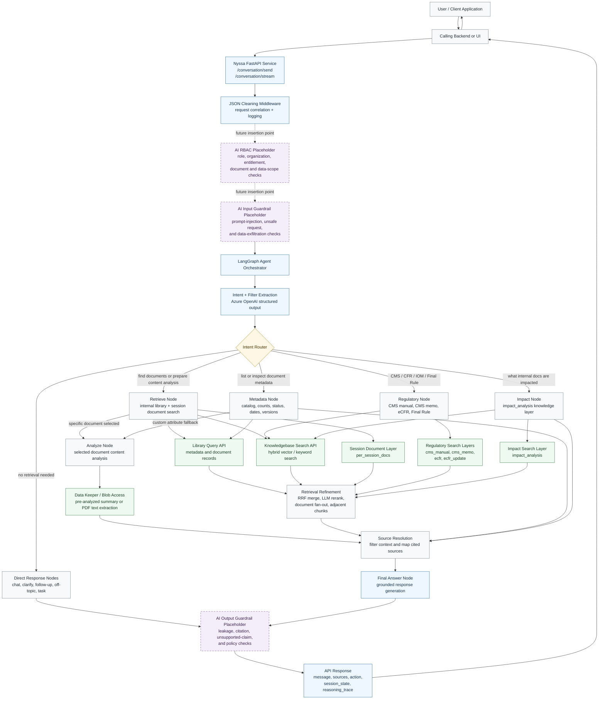

# Nyssa Vertical Flowchart

```mermaid
flowchart TD;
    U1["User / Client Application"];
    U2["Calling Backend or UI"];
    A1["Nyssa FastAPI Service<br/>/conversation/send<br/>/conversation/stream"];
    A2["JSON Cleaning Middleware<br/>request correlation + logging"];

    G1["AI RBAC Placeholder<br/>role, organization, entitlement,<br/>document and data-scope checks"];
    G2["AI Input Guardrail Placeholder<br/>prompt-injection, unsafe request,<br/>and data-exfiltration checks"];

    O1["LangGraph Agent Orchestrator"];
    O2["Intent + Filter Extraction<br/>Azure OpenAI structured output"];
    O3{"Intent Router"};

    R1["Retrieve Node<br/>internal library + session document search"];
    M1["Metadata Node<br/>catalog, counts, status, dates, versions"];
    C1["Regulatory Node<br/>CMS manual, CMS memo, eCFR, Final Rule"];
    I1["Impact Node<br/>impact_analysis knowledge layer"];
    D1["Direct Response Nodes<br/>chat, clarify, follow-up, off-topic, task"];

    X1["Library Query API<br/>metadata and document records"];
    X2["Knowledgebase Search API<br/>hybrid vector / keyword search"];
    X3["Session Document Layer<br/>per_session_docs"];
    X4["Regulatory Search Layers<br/>cms_manual, cms_memo,<br/>ecfr, ecfr_update"];
    X5["Impact Search Layer<br/>impact_analysis"];

    P1["Retrieval Refinement<br/>RRF merge, LLM rerank,<br/>document fan-out, adjacent chunks"];
    N1["Analyze Node<br/>selected document content analysis"];
    B1["Data Keeper / Blob Access<br/>pre-analyzed summary or PDF text extraction"];

    S1["Source Resolution<br/>filter context and map cited sources"];
    F1["Final Answer Node<br/>grounded response generation"];
    G3["AI Output Guardrail Placeholder<br/>leakage, citation, unsupported-claim,<br/>and policy checks"];
    Z1["API Response<br/>message, sources, action,<br/>session_state, reasoning_trace"];

    U1 --> U2;
    U2 --> A1;
    A1 --> A2;
    A2 -. future insertion point .-> G1;
    G1 -. future insertion point .-> G2;
    G2 --> O1;
    O1 --> O2;
    O2 --> O3;

    O3 -->|find documents or prepare content analysis| R1;
    O3 -->|list or inspect document metadata| M1;
    O3 -->|CMS / CFR / IOM / Final Rule| C1;
    O3 -->|what internal docs are impacted| I1;
    O3 -->|no retrieval needed| D1;

    R1 --> X1;
    R1 --> X2;
    R1 --> X3;
    M1 --> X1;
    C1 --> X2;
    C1 --> X4;
    I1 --> X2;
    I1 --> X5;

    X1 --> P1;
    X2 --> P1;
    X3 --> P1;
    X4 --> P1;
    X5 --> P1;

    R1 -->|specific document selected| N1;
    M1 -->|custom attribute fallback| N1;
    N1 --> B1;
    B1 --> S1;

    P1 --> S1;
    M1 --> S1;
    I1 --> S1;
    S1 --> F1;
    D1 --> G3;
    F1 --> G3;
    G3 --> Z1;
    Z1 --> U2;
    U2 --> U1;

    classDef placeholder stroke-dasharray: 6 4,stroke:#7a5195,color:#3b2250,fill:#f4edfa;
    classDef api fill:#eef6ff,stroke:#2f6f9f,color:#17324d;
    classDef decision fill:#fff7e6,stroke:#ad7b00,color:#4a3200;
    classDef data fill:#eefaf1,stroke:#3f7d4a,color:#173b20;
    classDef process fill:#f7f9fb,stroke:#74808a,color:#1f2933;

    class G1,G2,G3 placeholder;
    class A1,A2,O1,O2,F1,Z1 api;
    class O3 decision;
    class X1,X2,X3,X4,X5,B1 data;
    class U1,U2,R1,M1,C1,I1,D1,P1,N1,S1 process;
```
