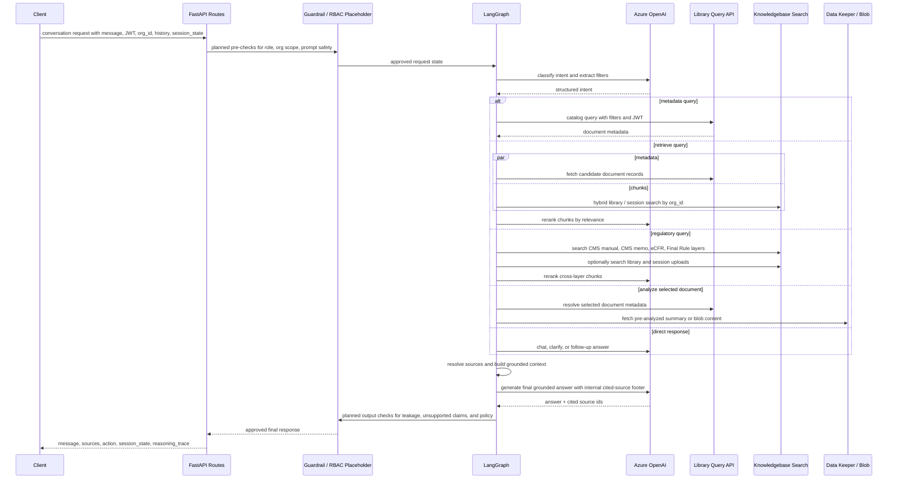

# Nyssa High-Level Architecture

Last updated: 2026-05-21

This diagram is based on the current repository implementation. Solid components are present in the code today. Dashed components are proposed placeholders for client review.

## Client-Review Flowchart

```mermaid
flowchart LR
    user["User / Client Application"]
    caller["Calling Backend or UI"]
    api["Nyssa FastAPI Service<br/>/conversation/send<br/>/conversation/stream"]
    middleware["JSON Cleaning Middleware<br/>request correlation + logging"]

    rbac["AI RBAC Placeholder<br/>role, org, entitlement, and data-scope checks"]
    guardIn["AI Guardrail Placeholder<br/>input safety, prompt-injection, and policy checks"]

    graph["LangGraph Agent Orchestrator"]
    intent["Intent + Filter Extraction<br/>Azure OpenAI structured output"]
    router{"Intent Router"}

    retrieve["Retrieve Node<br/>internal library + session search"]
    metadata["Metadata Node<br/>catalog, counts, status, dates, versions"]
    regulatory["Regulatory Node<br/>CMS manual, CMS memo, eCFR, Final Rule"]
    impact["Impact Node<br/>impact_analysis knowledge layer"]
    analyze["Analyze Node<br/>document content analysis"]
    direct["Direct Response Nodes<br/>chat, clarify, follow-up, off-topic, task"]

    rank["Retrieval Refinement<br/>RRF merge, LLM rerank,<br/>document fan-out, adjacent chunks"]
    sources["Source Resolution<br/>filter context + map cited sources"]
    final["Final Answer Node<br/>grounded response generation"]
    guardOut["AI Guardrail Placeholder<br/>output safety, leakage, citation, and tone checks"]
    response["API Response<br/>message, sources, action,<br/>session_state, reasoning_trace"]

    user --> caller --> api --> middleware
    middleware -. future insertion point .-> rbac
    rbac -. future insertion point .-> guardIn
    guardIn --> graph --> intent --> router

    router -->|find documents or prepare content analysis| retrieve
    router -->|list or inspect document metadata| metadata
    router -->|CMS / CFR / IOM / Final Rule| regulatory
    router -->|what internal docs are impacted| impact
    router -->|no retrieval needed| direct

    retrieve --> rank
    retrieve -->|specific document selected| analyze
    metadata -->|custom attribute fallback| analyze
    regulatory --> rank
    impact --> sources
    metadata --> sources
    analyze --> sources
    rank --> sources --> final
    direct --> guardOut
    final --> guardOut --> response --> caller --> user

    classDef placeholder stroke-dasharray: 6 4,stroke:#7a5195,color:#3b2250,fill:#f4edfa;
    classDef core fill:#eef6ff,stroke:#2f6f9f,color:#17324d;
    classDef node fill:#f7f9fb,stroke:#74808a,color:#1f2933;
    classDef decision fill:#fff7e6,stroke:#ad7b00,color:#4a3200;

    class rbac,guardIn,guardOut placeholder;
    class api,middleware,graph,intent,final core;
    class router decision;
    class retrieve,metadata,regulatory,impact,analyze,direct,rank,sources,response,user,caller node;
```

## External System View

```mermaid
flowchart TB
    subgraph nyssa["Nyssa Agentic API Container"]
        api["FastAPI routes"]
        graph["LangGraph workflow"]
        tools["Tool layer"]
        logs["Structured app logs<br/>request_id scoped"]
    end

    subgraph llm["Azure OpenAI"]
        llmMain["Chat model<br/>intent, rerank, final answer"]
    end

    subgraph data["Document and Knowledge Services"]
        library["Library Query API<br/>metadata + catalog records"]
        search["Knowledgebase Search API<br/>hybrid vector / keyword search"]
        dataKeeper["Data Keeper Service<br/>document summary + blob proxy"]
        blob["Blob Storage<br/>PDF and document bytes"]
    end

    subgraph indexes["Search Layers"]
        libraryLayers["Library layers<br/>policies, memos, uncategorised"]
        sessionLayer["per_session_docs<br/>current chat uploads"]
        regulatoryLayers["Regulatory layers<br/>cms_manual, cms_memo,<br/>ecfr, ecfr_update"]
        impactLayer["impact_analysis layer"]
    end

    api --> graph --> tools
    graph --> llmMain
    tools --> llmMain
    tools --> library
    tools --> search
    tools --> dataKeeper
    dataKeeper --> blob
    search --> libraryLayers
    search --> sessionLayer
    search --> regulatoryLayers
    search --> impactLayer
    api --> logs
    graph --> logs
    tools --> logs
```

## Request Flow



## Main Components

| Area | Current implementation | Client-facing explanation |
|---|---|---|
| API layer | FastAPI app with `/health`, `/conversation/send`, and `/conversation/stream` | Receives chat requests and returns either a normal response or streaming SSE tokens. |
| State model | Pydantic request and response models plus LangGraph `AgentState` | Carries message, organization, JWT, session memory, selected docs, sources, and trace data across nodes. |
| Orchestration | LangGraph workflow in `agent/graph.py` | Classifies the user request, routes it to the right specialist path, and combines results into one answer. |
| Intent extraction | Azure OpenAI structured output | Converts natural language into an action plus filters such as document type, filename, dates, status, custom attributes, session-document preference, and regulatory layer hints. |
| Retrieval | Library query API, knowledgebase search, session document search, RRF, LLM reranking | Finds relevant records and chunks from internal documents and current-session uploads, then ranks them before answer generation. |
| Regulatory search | CMS manual, CMS memo, eCFR, and eCFR update layers | Handles external regulatory questions separately from the organization's internal library. |
| Analysis | Pre-analyzed document summaries plus blob/PDF extraction fallback | Reads selected document content when the user asks for a summary, explanation, or content-level answer. |
| Source resolution | Unified source resolver and final citation filtering | Only returns sources that the answer actually used, while keeping internal IDs out of the visible message. |
| Observability | Request-scoped logs and `reasoning_trace` in the API response | Makes routing, retrieval, fallback, confidence, and source decisions auditable per request. |

## Guardrail and RBAC Placeholders

The current service forwards `jwt_token` to the library query API and scopes search calls by `organization_id`. The diagram reserves explicit insertion points for:

- **AI RBAC Placeholder**: central policy check for user role, organization, document permissions, feature entitlements, and whether the user can access specific document sources before retrieval or response.
- **Input Guardrail Placeholder**: prompt-injection checks, unsafe request filtering, data-exfiltration prevention, and request normalization before the LangGraph workflow.
- **Output Guardrail Placeholder**: final answer inspection for unsupported claims, accidental internal identifier leakage, source-citation policy, sensitive content handling, and tone/compliance constraints.

## Presentation Summary

Nyssa is an agentic healthcare compliance assistant. The API receives a user question, preserves session context, classifies the user's intent, retrieves from the correct source systems, reranks and filters evidence, and generates a grounded answer with sources and an audit trace. Internal library questions, metadata listings, regulatory questions, impact-analysis questions, and document-analysis requests use different paths, but all converge through source resolution and final grounded answer generation. The proposed AI RBAC and guardrail components can be positioned before retrieval and after answer generation so access control and safety policy are enforced consistently.
